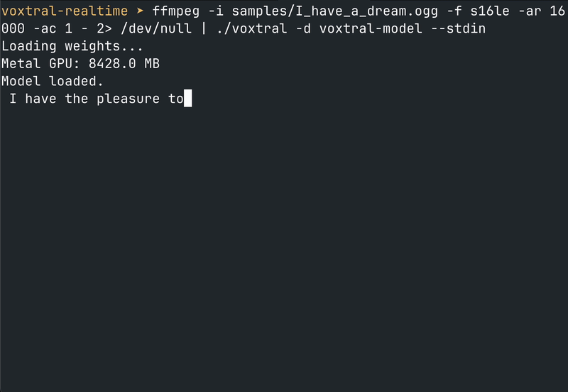

# Voxtral Realtime 4B - Project Instructions

Pure C implementation of Mistral AI's Voxtral Realtime 4B speech-to-text model.
HuggingFace: `mistralai/Voxtral-Mini-4B-Realtime-2602`



## Quick Reference

```bash
# Build
make mps       # Apple Silicon (fastest)
make blas      # CPU with BLAS (Accelerate on macOS, OpenBLAS on Linux)
make clean

# Test (slow — needs fast Apple Silicon GPU, ~2 min on M3/M4 Max)
make test

# Run (tokens stream to stdout as generated)
./voxtral -d voxtral-model -i audio.wav            # default: timing info on stderr
./voxtral -d voxtral-model -i audio.wav --silent    # no stderr output
./voxtral -d voxtral-model -i audio.wav --debug     # per-layer/per-chunk details
./voxtral -d voxtral-model -i audio.wav --alt 0.5   # show alternative tokens inline

# Microphone input (macOS only, Ctrl+C to stop)
./voxtral -d voxtral-model --from-mic               # default: 2s processing interval
./voxtral -d voxtral-model --from-mic -I 1.0         # 1s interval for lower latency

# Stdin input (auto-detects WAV vs raw s16le 16kHz mono)
cat audio.wav | ./voxtral -d voxtral-model --stdin
ffmpeg -i samples/I_have_a_dream.ogg -f s16le -ar 16000 -ac 1 - | ./voxtral -d voxtral-model --stdin

# Download model (~8.9GB)
./download_model.sh

# Python reference implementation (self-contained, no mistral_common needed)
./pyenv312/bin/python python_simple_implementation.py voxtral-model test_speech.wav
```

## Key Files

```
main.c                      - CLI entry point
voxtral.h                   - Main API header
voxtral.c                   - Pipeline, streaming API, context management
voxtral_encoder.c           - Audio encoder (32 layers)
voxtral_decoder.c           - LLM decoder (26 layers, GQA)
voxtral_audio.c/.h          - WAV loading, mel spectrogram, incremental mel
voxtral_tokenizer.c/.h      - Tekken tokenizer
voxtral_kernels.c/.h        - Math kernels (matmul, attention, norms)
voxtral_safetensors.c/.h    - Safetensors reader (mmap)
voxtral_mic.h               - Microphone capture API
voxtral_mic_macos.c         - macOS mic capture (AudioQueue)
voxtral_metal.m/.h          - Metal GPU backend
voxtral_shaders.metal       - Metal compute shaders
python_simple_implementation.py - Self-contained Python reference
MODEL.md                    - Architecture & weight format reference
vllm/                       - Upstream vLLM clone (official reference)
```

## Streaming Architecture

The encoder uses an incremental KV cache (same as the decoder). Audio is processed
in chunks: conv stem tail buffers handle boundary correctness, and the encoder
transformer only processes new positions against cached K/V. Rolling compaction
at window=750 keeps memory bounded.

`vox_set_processing_interval(s, seconds)` controls how often the encoder triggers.
Default: 2.0s. Lower = more responsive (higher GPU overhead), higher = more efficient
batching (higher latency). For offline file transcription the interval is irrelevant
since all audio is available at once.

## Alternative Tokens API

`vox_stream_set_alt(s, n_alt, cutoff)` enables tracking up to `n_alt` alternatives
per token position (max `VOX_MAX_ALT`=4). After softmax, a candidate qualifies if
`1 - prob[i]/prob[0] <= cutoff`.

`vox_stream_get_alt(s, out, max_tokens, n_alt)` returns `n_alt` consecutive
`const char *` per position: `[0]`=best, rest=alternatives or NULL. Like
`vox_stream_get()`, call in a loop until it returns 0 to drain all tokens.

CLI: `--alt <cutoff>` formats output as `[best|alt1|alt2]` when alternatives exist.

## Architecture

See MODEL.md for full architecture details, weight tensor names, tokenizer layout, and decode schedule.

## Development Rules

1. No dependencies unless absolutely necessary
2. No marginal (<1%) speed improvements that add complexity
3. Test every code modification
4. Simple, understandable code
5. No dead code
6. Standard C only (no compiler-specific tricks)
7. WAV file input, stdin (WAV or raw s16le 16kHz mono), or microphone (macOS)
8. BF16 weights, F32 computation on CPU
9. Keep MODEL.md updated as the architecture reference

## Reference Audio

- `test_speech.wav`: "Hello, this is a test of the voxtral speech to text system."
- `samples/I_have_a_dream.ogg`: MLK speech (~3 min). Use via ffmpeg stdin pipe:
  `ffmpeg -i samples/I_have_a_dream.ogg -f s16le -ar 16000 -ac 1 - 2>/dev/null | ./voxtral -d voxtral-model --stdin`
- Model output may differ slightly (e.g. "VoxTroll" vs "voxtral"). Treat as smoke test.

## Official Reference

- Upstream vLLM clone: `vllm/` (authoritative for official behavior)
- `vendor_reference/` is a snapshot for local comparison (not authoritative)
